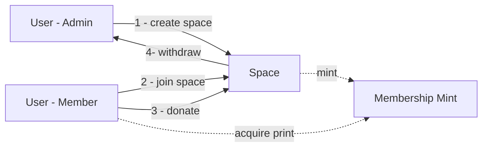
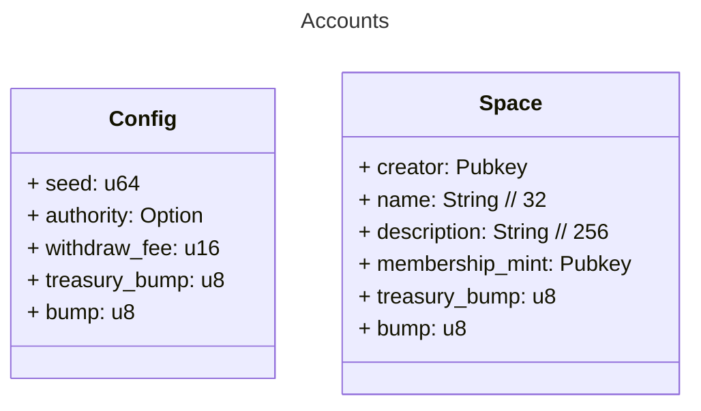
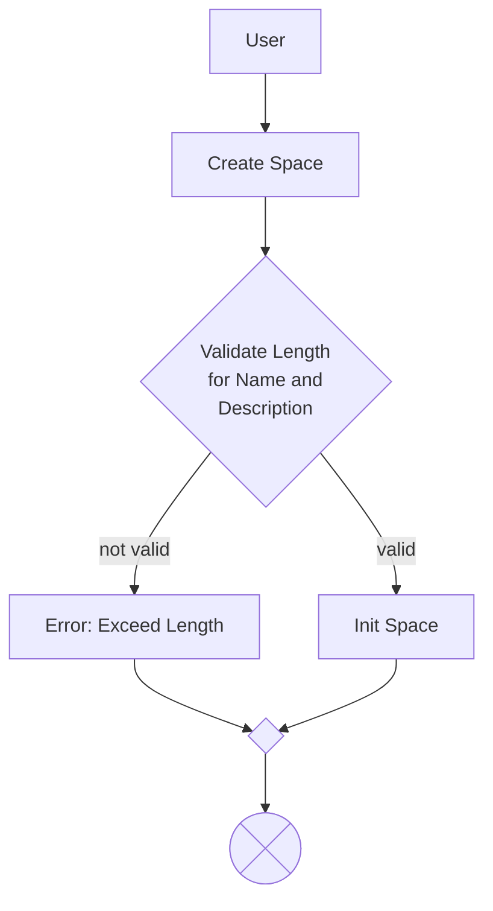
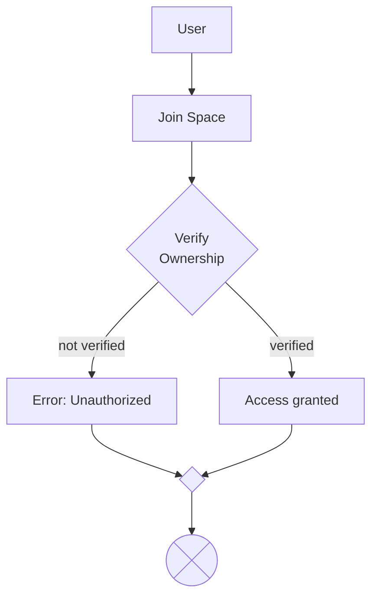
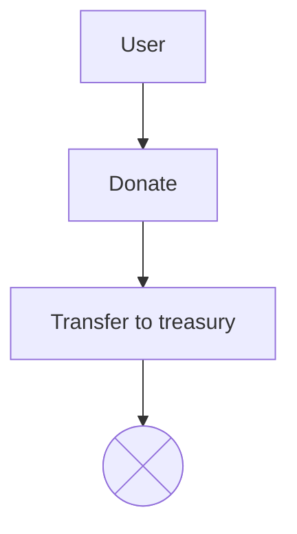
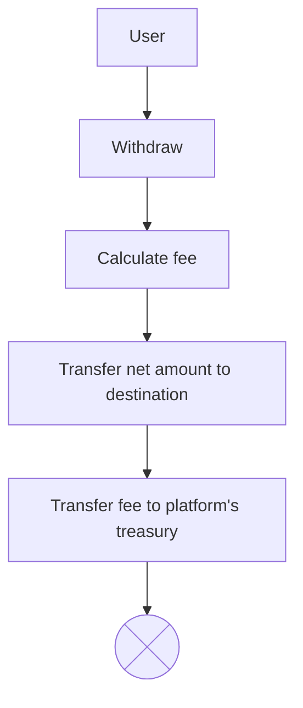

## Architecture Design

### Requirment

- The platform should allow user to create a space
- The platform should allow user to mint membership NFT collection
- The platform should allow user to join a space
- The platform should allow user with access token to chat inside the space
- The platform should allow user with space authority to start a livestream\*
- The platform should allow user to transfer lamports to space treasury
- The platform should allow user with authority to withdraw from space treasury
- The platform should claim fee from treasury withdrawal\*

Note:

\*TBD

#### Overview

1. Create Space

- User create a space
- User mint membership

2. Join Space

- Platform verify membership
- User granted access to social features

3. Donate

- User transfer to space treasury

4. Withdraw

- User with authority can withdraw from treasury
- Platform claim withdraw fee

##### Accounts

##### Create Space

##### Join Space

##### Donate

##### Withdraw

